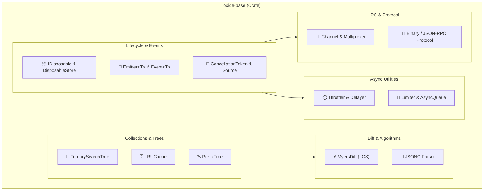

# VS Code Base レイヤー アーキテクチャ設計書 (C4 Model & Rust 実装)

> **文書ステータス — 将来仕様**: 本書は設計・要件上の目標を記録するものであり、記載内容が実装済みであることを示しません。現在の実装状況と制限は [プロジェクト状況](../project-status.md) を参照してください。

> 本ドキュメントは、VS Code の基盤層 (`src/vs/base/`) を Rust で構築するためのコンポーネント設計書です。

---

## 1. コンポーネント構成図 (C4 Component Diagram)



---

## 2. コアモジュール設計

### 2.1 `Lifecycle` (`oxide_base::lifecycle`)
```rust
pub trait Disposable: Send + Sync {
    fn dispose(&mut self);
}

#[derive(Default)]
pub struct DisposableStore {
    to_dispose: Vec<Box<dyn Disposable>>,
    is_disposed: bool,
}

impl DisposableStore {
    pub fn add<T: Disposable + 'static>(&mut self, item: T) {
        if self.is_disposed {
            let mut item = item;
            item.dispose();
        } else {
            self.to_dispose.push(Box::new(item));
        }
    }

    pub fn clear(&mut self) {
        for mut item in self.to_dispose.drain(..) {
            item.dispose();
        }
    }
}

impl Drop for DisposableStore {
    fn drop(&mut self) {
        self.dispose();
    }
}
```

### 2.2 `Event` & `Emitter` (`oxide_base::event`)
```rust
use std::sync::{Arc, Mutex};

pub type Listener<T> = Arc<dyn Fn(&T) + Send + Sync>;

pub struct Emitter<T: Clone + Send + Sync + 'static> {
    listeners: Arc<Mutex<Vec<Listener<T>>>>,
    disposed: bool,
}

impl<T: Clone + Send + Sync + 'static> Emitter<T> {
    pub fn new() -> Self {
        Self {
            listeners: Arc::new(Mutex::new(Vec::new())),
            disposed: false,
        }
    }

    pub fn event(&self) -> Event<T> {
        Event {
            listeners: Arc::clone(&self.listeners),
        }
    }

    pub fn fire(&self, event: &T) {
        if self.disposed {
            return;
        }
        let listeners = self.listeners.lock().unwrap().clone();
        for listener in listeners {
            listener(event);
        }
    }
}
```

### 2.3 `TernarySearchTree` (`oxide_base::collections::tst`)
- **計算量:**
  - 検索: $O(K + \ln N)$ ($K$: キー長, $N$: ノード数)
  - プレフィックス一致探索: $O(K + M)$ ($M$: マッチ件数)
- **用途:**
  - ファイルツリーのパス検索（`.gitignore` のルールマッチ判定、ディレクトリ監視の対象判定）
