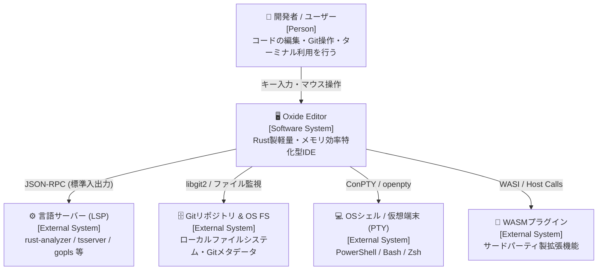
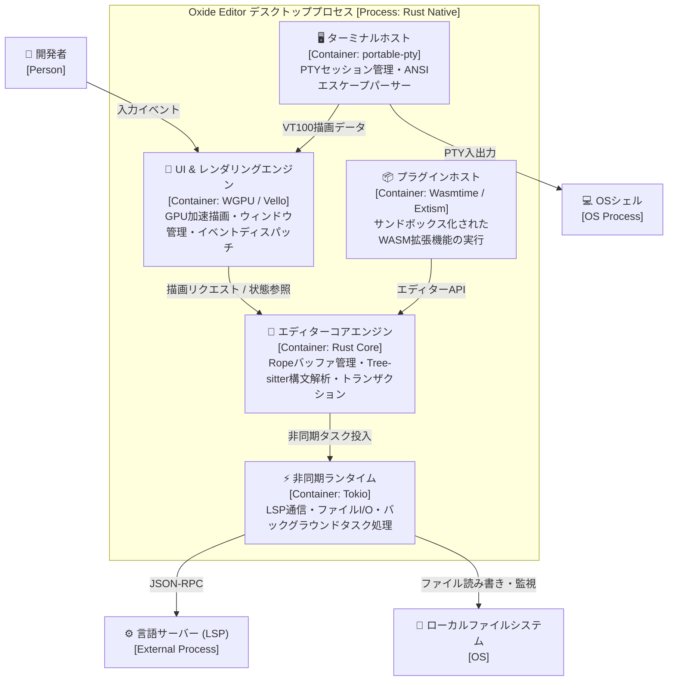
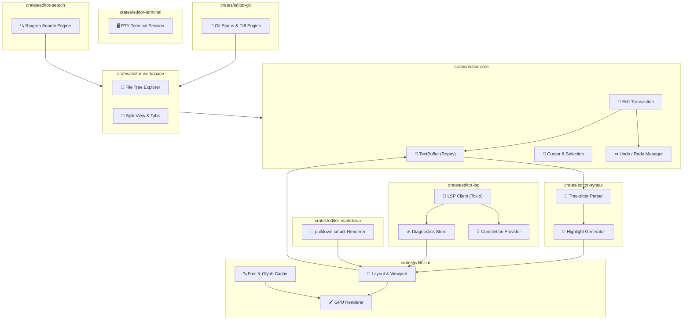
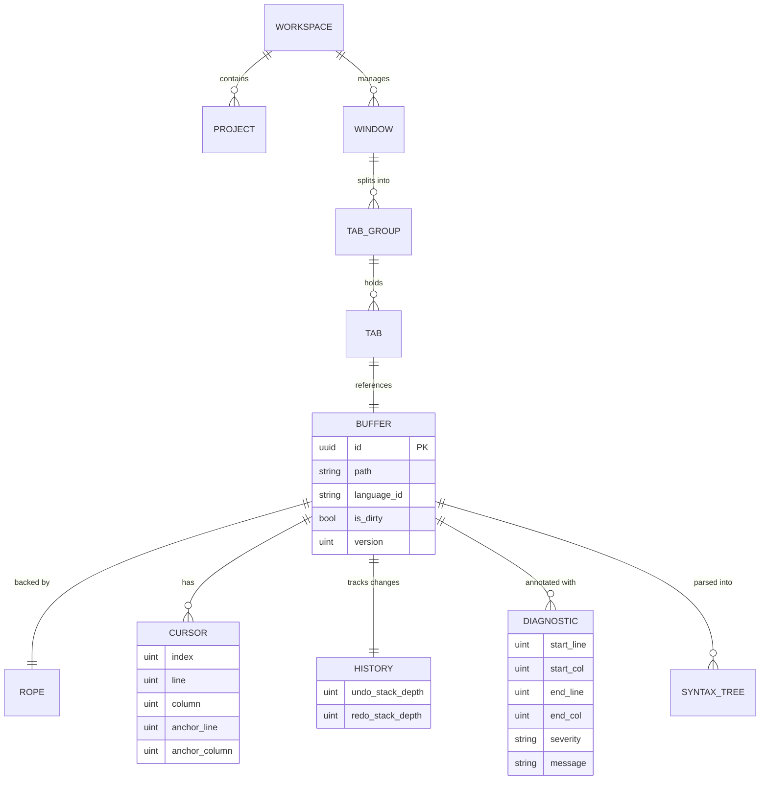

# Oxide Editor システム設計書（C4モデル準拠）

> C4モデル（Context / Container / Component）に準拠したアーキテクチャ設計書です。  
> VS Code 代替となる Rust 製軽量・高性能 IDE の内部構成、データフロー、コンポーネント責務を定義します。

---

## メタ情報

| 項目 | 値 |
|------|-----|
| プロジェクト名 | Oxide Editor |
| バージョン | 1.0.0 |
| 作成日 | 2026-08-22 |
| 最終更新日 | 2026-08-22 |
| 作成者 | Syun |

---

## 1. Level 1: システムコンテキスト図（Context Diagram）

### 1.1 説明

Oxide Editor は、開発者がローカル環境でコードを記述・編集・デバッグするためのデスクトップアプリケーションです。  
Language Server Protocol (LSP) サーバー、ローカルの Git リポジトリ、OS シェル/PTY、外部 WASM プラグインと連携し、軽量かつ統合的な開発環境を提供します。

### 1.2 コンテキスト図

### 1.3 外部アクター・外部システム一覧

| 名前 | 種別 | 説明 |
|------|------|------|
| 開発者 | Person | IDE を操作してソースコードの作成・編集・ビルドを行うユーザー |
| 言語サーバー (LSP) | External System | 言語ごとの補完・診断・定義ジャンプ情報を提供する外部プロセス |
| Gitリポジトリ / OS FS | External System | ローカルのソースツリー、`.git` メタデータ、ファイル更新通知 |
| OSシェル / PTY | External System | 統合ターミナルから起動されるコマンドラインシェルプロセス |
| WASMプラグイン | External System | サンドボックス内で実行される拡張機能バイナリ |

---

## 2. Level 2: コンテナ図（Container Diagram）

### 2.1 コンテナ図

### 2.2 コンテナ一覧

| コンテナ名 | 技術スタック | 責務 | 通信プロトコル |
|-----------|------------|------|--------------|
| UI & レンダリングエンジン | WGPU / Vello / Cosmic-Text | 60/120fps GPU 描画、テキストグリフレンダリング、入力ハンドリング | 内部関数呼び出し |
| エディターコアエンジン | Ropey / Tree-sitter | Rope バッファ、マルチカーソル、Undo/Redo 履歴、構文木管理 | メモリ内データ参照 |
| 非同期ランタイム | Tokio | LSP クライアント、ファイル I/O、ripgrep 検索、バックグラウンドジョブ | tokio channels (mpsc/oneshot) |
| プラグインホスト | Wasmtime / Extism | WASM 拡張機能のロード、サンドボックス実行、ホスト API 提供 | WASM FFI / Memory Bridge |
| ターミナルホスト | portable-pty / alacritty_terminal | PTY 生成、プロセス入出力パイプ、ANSI/VT100 端末状態管理 | OS Pipes / Channels |

### 2.3 技術選定の根拠

| 技術 | 選定理由 | 代替案 |
|------|---------|--------|
| **Rust** | ガベージコレクション不要による予測可能な低レイテンシ・省メモリ、高並行性、メモリ安全性 | C++ (安全性懸念), Go (GC停止), TypeScript/Electron (メモリ肥大化) |
| **WGPU / Vello** | Vulkan / Metal / DirectX12 を統一抽象化し、GPU パス描画とフォントキャッシュを最大活用 | Skia (C++依存), OpenGL (旧式), Webview (リソース過大) |
| **Ropey (Rope構造)** | 巨大テキストでも O(log N) の挿入/削除、不変クローンによる並行アクセス・アンドゥ管理が極めて高速 | Piece Table, Gap Buffer (巨大ファイルでのメモリ再配置コスト大) |
| **Tree-sitter** | インクリメンタルパース対応、構文木ベースの正確なシンタックスハイライト | TextMate RegEx (重い正規表現バックトラック、文脈理解不足) |
| **Wasmtime (WASM)** | ネイティブに近い実行速度、確実なメモリサンドボックス、プラグイン障害時の本体保護 | Lua (型安全性不足), JS/QuickJS (パフォーマンス不足) |

---

## 3. Level 3: コンポーネント図（Component Diagram）

### 3.1 エディターコア & サブシステムのコンポーネント図

### 3.2 コンポーネント一覧

| コンポーネント名 | 所属クレート | 責務 | インターフェース |
|---------------|-----------|------|---------------|
| `TextBuffer` | `editor-core` | Rope データ構造によるテキスト保持、UTF-8/UTF-16 オフセット変換、行・桁インデックス管理 | Rust Trait / メソッド |
| `EditTransaction` | `editor-core` | アトミックなテキスト編集、マルチカーソル編集の一括適用、Undo 履歴生成 | Rust Struct |
| `TreeSitterParser` | `editor-syntax` | 言語ごとの文法ロード、テキスト差分に基づくインクリメンタル構文木更新 | Rust Struct |
| `HighlightEngine` | `editor-syntax` | Tree-sitter クエリおよびセマンティックトークンを統合したハイライト属性計算 | Rust Struct |
| `LspClient` | `editor-lsp` | 言語サーバープロセスの起動・ライフサイクル管理・非同期 JSON-RPC 通信 | Async Channel / Trait |
| `FileTree` | `editor-workspace` | ディレクトリ走査、仮想スクロール、ファイル変更監視（`notify`） | Rust Struct |
| `GitService` | `editor-git` | `git2` / CLI による差分計算、ステージング、コミット、ブランチ操作 | Rust Struct |
| `PtySession` | `editor-terminal` | `portable-pty` による端末プロセスの生成・双方向ストリーム制御 | Rust Struct |
| `RipgrepEngine` | `editor-search` | `grep-regex` / `ignore` によるマルチスレッドプロジェクト全体検索 | Rust Struct |
| `MdParser` | `editor-markdown` | `pulldown-cmark` による Markdown AST 解析と即時プレビューレンダリング | Rust Struct |
| `PluginHost` | `editor-plugin` | WASM インスタンスの管理、サンドボックス実行、API 呼び出しルーティング | Rust Struct |

---

## 4. データモデル

### 4.1 エディターコア内部データモデル

---

## 5. セキュリティ考慮事項

| 観点 | 対策 |
|------|------|
| **WASM サンドボックス** | 拡張機能はファイルシステムやネットワークへの直接アクセスを禁止し、許可された Host API 経由でのみ制限付きアクセスを許可する。 |
| **外部プロセス実行** | LSP サーバーや PTY シェル実行時、ユーザー意図しない任意のバイナリ実行を防ぐため、実行可能ファイルのパス検証と引数サニタイズを徹底する。 |
| **メモリ安全性** | Rust の所有権・借用チェッカーにより、バッファオーバーフロー、Use-After-Free、データ競合をコンパイル時に完全排除する。 |
| **大容量ファイル耐性** | メモリ枯渇攻撃（DoS）を防ぐため、一定サイズ以上のファイルはストリーミング読み込みと部分ロードを行い、OS メモリ枯渇を防止する。 |

---

## 6. 変更履歴

| バージョン | 日付 | 変更内容 | 変更者 |
|-----------|------|---------|--------|
| 1.0.0 | 2026-08-22 | 初版作成（C4モデル準拠のアーキテクチャ設計書） | Syun |
