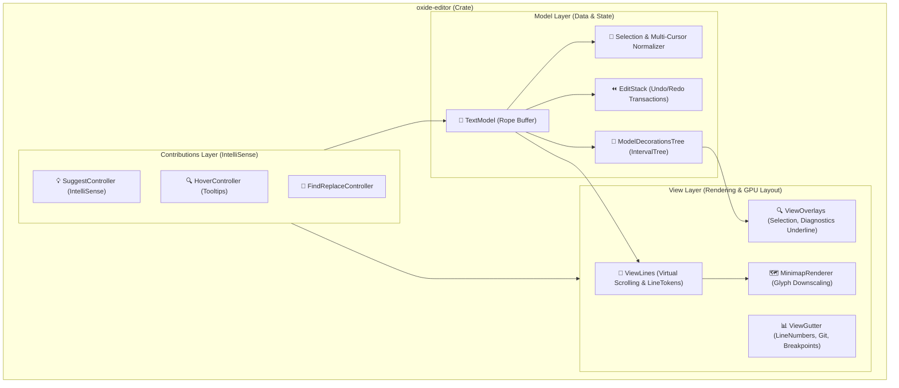

# Monaco Editor コア アーキテクチャ設計書 (C4 Model & Rust 実装)

> **文書ステータス — 将来仕様**: 本書は設計・要件上の目標を記録するものであり、記載内容が実装済みであることを示しません。現在の実装状況と制限は [プロジェクト状況](../project-status.md) を参照してください。

> 本ドキュメントは、VS Code の Monaco Editor コア (`src/vs/editor/`) を Rust で構築するためのコンポーネント設計書です。

---

## 1. コンポーネント構成図 (C4 Component Diagram)



---

## 2. コアモジュール設計

### 2.1 `TextModel` (`oxide_editor::model::text_model`)
```rust
use ropey::Rope;
use std::sync::Arc;

pub struct TextModel {
    id: String,
    buffer: Rope,
    version_id: usize,
    undo_stack: Vec<EditTransaction>,
    redo_stack: Vec<EditTransaction>,
    decorations: Vec<ModelDecoration>,
}

#[derive(Debug, Clone, Copy, PartialEq, Eq)]
pub struct Position {
    pub line_number: usize, // 1-indexed
    pub column: usize,      // 1-indexed
}

#[derive(Debug, Clone, Copy, PartialEq, Eq)]
pub struct Range {
    pub start: Position,
    pub end: Position,
}
```

### 2.2 `ModelDecoration` & `IntervalTree`
- **追従アルゴリズム:**
  - バッファ編集時、編集位置より後ろにあるデコレーションの `Range` をオフセット分だけ即座にシフト。
  - 区間木（IntervalTree）により、現在の可視範囲（`start_line..end_line`）に交差するデコレーションを $O(\log N + K)$ で抽出。
