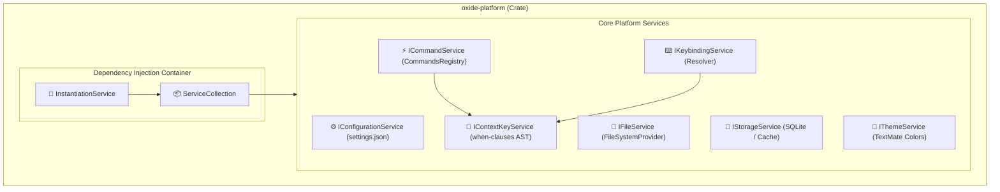

# VS Code Platform サービス層 アーキテクチャ設計書 (C4 Model & Rust 実装)

> 本ドキュメントは、VS Code のサービス層 (`src/vs/platform/`) を Rust で構築するためのアーキテクチャ設計書です。

---

## 1. コンポーネント構成図 (C4 Component Diagram)



---

## 2. コアモジュール設計

### 2.1 `InstantiationService` (`oxide_platform::instantiation`)
```rust
use std::any::{Any, TypeId};
use std::collections::HashMap;
use std::sync::Arc;

pub struct ServiceCollection {
    services: HashMap<TypeId, Arc<dyn Any + Send + Sync>>,
}

impl ServiceCollection {
    pub fn new() -> Self {
        Self {
            services: HashMap::new(),
        }
    }

    pub fn set<T: Send + Sync + 'static>(&mut self, instance: Arc<T>) {
        self.services.insert(TypeId::of::<T>(), instance);
    }

    pub fn get<T: 'static>(&self) -> Option<Arc<T>> {
        self.services
            .get(&TypeId::of::<T>())
            .and_then(|any| any.clone().downcast::<T>().ok())
    }
}
```

### 2.2 `ContextKeyService` (`oxide_platform::contextkey`)
- **`when` 句の AST 定義:**
```rust
#[derive(Debug, Clone, PartialEq)]
pub enum ContextKeyExpr {
    Defined(String),
    Not(Box<ContextKeyExpr>),
    Equals(String, String),
    NotEquals(String, String),
    And(Vec<ContextKeyExpr>),
    Or(Vec<ContextKeyExpr>),
    Regex(String, String),
}

pub struct ContextKeyService {
    context: std::sync::RwLock<std::collections::HashMap<String, String>>,
}

impl ContextKeyService {
    pub fn evaluate(&self, expr: &ContextKeyExpr) -> bool {
        let ctx = self.context.read().unwrap();
        match expr {
            ContextKeyExpr::Defined(key) => ctx.contains_key(key),
            ContextKeyExpr::Not(inner) => !self.evaluate(inner),
            ContextKeyExpr::Equals(key, val) => ctx.get(key).map_or(false, |v| v == val),
            ContextKeyExpr::NotEquals(key, val) => ctx.get(key).map_or(true, |v| v != val),
            ContextKeyExpr::And(exprs) => exprs.iter().all(|e| self.evaluate(e)),
            ContextKeyExpr::Or(exprs) => exprs.iter().any(|e| self.evaluate(e)),
            _ => true,
        }
    }
}
```

### 2.3 `KeybindingResolver` (`oxide_platform::keybinding`)
- キー押下イベントを受信した際、登録されているキーバインドの中から `when` 式を評価して最も一致度の高いコマンド ID を特定し、`ICommandService::execute` へディスパッチ。
