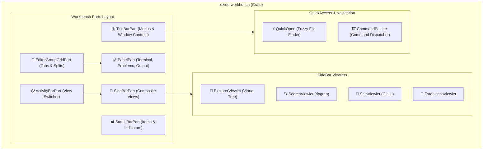

# VS Code Workbench (UI Shell) アーキテクチャ設計書 (C4 Model & Rust 実装)

> 本ドキュメントは、VS Code の Workbench UI シェル (`src/vs/workbench/`) を Rust で構築するためのアーキテクチャ設計書です。

---

## 1. コンポーネント構成図 (C4 Component Diagram)



---

## 2. コアレイアウトエンジン (`GridWidget`)

VS Code の柔軟なエディター分割は、再帰的な 2 次元分割木（2D Grid Tree）によって実現されています。

```rust
pub enum GridNode<T> {
    Leaf(T),
    Branch {
        orientation: Orientation, // Horizontal | Vertical
        children: Vec<(f32, Box<GridNode<T>>)>, // (ratio/size, child)
    },
}

pub struct EditorGroupGrid {
    root: GridNode<EditorGroup>,
    active_group_id: usize,
}
```

- **水平分割 (Split Right):** 親ノードを `Orientation::Horizontal` で 2 分割。
- **垂直分割 (Split Down):** 親ノードを `Orientation::Vertical` で 2 分割。
- **リサイズ:** 分割バー（Splitter）のドラッグ時に隣接ノードの比率を再計算。
