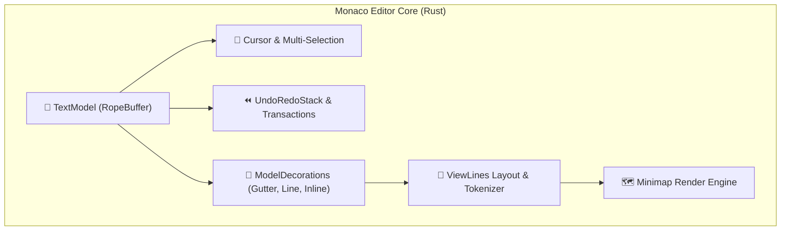

# Monaco Editor コア機能の Rust 再現設計書

> VS Code の核となる Monaco Editor (`src/vs/editor`) のデータ構造、テキストモデル、ビューレイヤー、デコレーターシステムを Rust で再現するための設計書です。

---

## 1. Monaco Editor の構成要素

---

## 2. 主要モジュール仕様

### 2.1 `TextModel`
- **データ構造:** `ropey::Rope`
- **機能:**
  - `getValue()`, `getValueInRange(range)`
  - `applyEdits(operations)`
  - `getLineContent(lineNumber)`, `getLineCount()`
  - `getPositionAt(offset)`, `getOffsetAt(position)`

### 2.2 `ModelDecoration` (デコレーターシステム)
- **Gutter Decorations:**
  - Git 追加（緑バー）、変更（青バー）、削除（赤三角）
  - ブレークポイント（赤丸）
  - コード折りたたみ（`+` / `-`）
- **Line Decorations:**
  - 現在行ハイライト
  - 差分削除行・追加行の背景色
- **Inline Decorations:**
  - LSP 診断エラー（赤波線）、警告（黄波線）、情報（青波線）
  - 検索マッチハイライト（黄背景）
  - 選択範囲ハイライト

### 2.3 `Minimap` (ミニマップ)
- エディター右側に 1/8 スケールの縮小ビューを描画。
- シンタックスハイライト色を保ちながら、現在のスクロール領域を示すスライダーを表示。
- クリック/ドラッグで任意の行へ瞬間ジャンプ。
